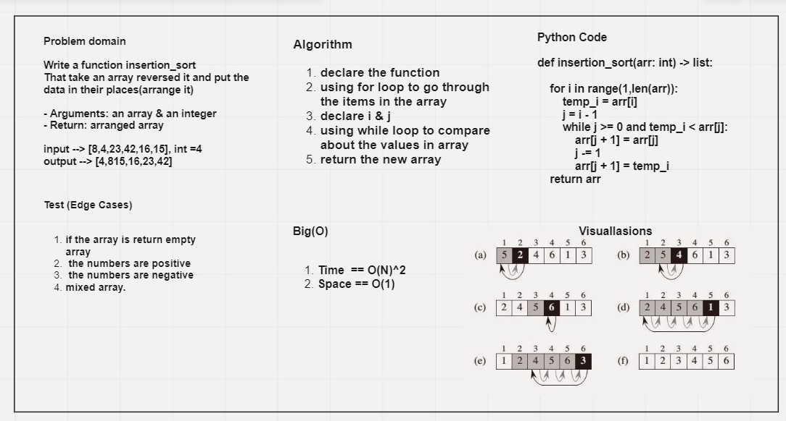

# Insertion Sort.

## -Language: `Python`
## -Challenge Type:  Code Challenge / Tracing a Pseudocode 

## [Code in Python](https://github.com/mohammad-alshish/data-structures-and-algorithms/blob/main/Insertion_sort/Insertion_sort.py)
## [tests](https://github.com/mohammad-alshish/data-structures-and-algorithms/blob/main/tests/test_Insertion_sort.py)
## [Code Tracing](https://mohammad-alshish/data-structures-and-algorithms/blob/main/Insertion_sort/Trace.md)

## -Assignment

Review the pseudocode below, then trace the algorithm by stepping through the process with the provided sample array. Document your explanation by creating a blog article that shows the step-by-step output after each iteration through some sort of visual.

Once you are done with your article, code a working, tested implementation of Insertion Sort based on the pseudocode provided.

### --> Pseudocode

    InsertionSort(int[] arr)

    FOR i = 1 to arr.length

      int j <-- i - 1
      int temp <-- arr[i]

      WHILE j >= 0 AND temp < arr[j]
        arr[j + 1] <-- arr[j]
        j <-- j - 1

      arr[j + 1] <-- temp

## -Whiteboard Process

 

## -Approach & Efficiency

>Big(O)
>>- Time  == O(N)^2
>>- Space == O(1)
>>- **Note: you will find the description in the Trace**

## -Solution
- Algorithm
1. declare the function
2. using for loop to go through the items in the array
3. declare i & j
4. using while loop to compare about the values in array 
5. return the new array

The code the have test folder so you can run **`pytest .\tests\test_Insertion_sort`** and there is an example in the code file you can run it and check the output.