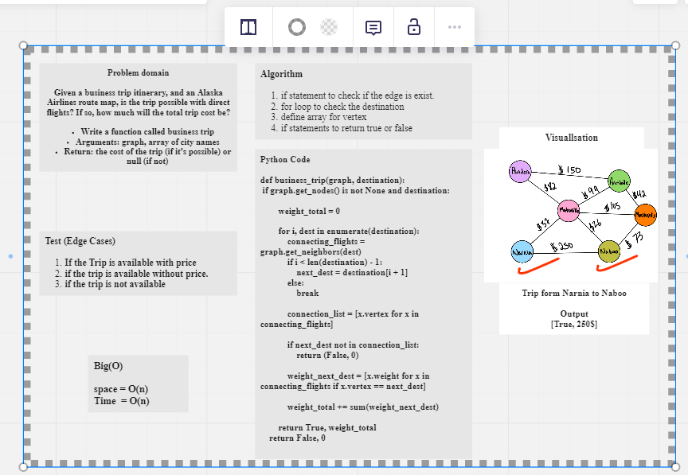

# Graphs

## Language: `Python`
## Challenge Type: ` Code Challenge / Algorithm`

## Graph business trip

## [Code](https://github.com/mohammad-alshish/data-structures-and-algorithms/blob/main/graph_business_trip/graph_business_trip.py)
## [tests](https://github.com/mohammad-alshish/data-structures-and-algorithms/blob/main/tests/test_graph_business_trip.py)

## Challenge

Given a business trip itinerary, and an Alaska Airlines route map, is the trip possible with direct flights? If so, how much will the total trip cost be?

Write a function called business trip
Arguments: graph, array of city names
Return: the cost of the trip (if it’s possible) or null (if not)

## Whiteboard Process

## Approach & Efficiency
We tried to keep our code as simple as possible to the best performance by reducing space/Time complexity
so we end with the following

Big O:
1. Time complexity => O(N) 
2. Space complexity => O(N)

> The code have test folder, so you can run **`>>pytest .\tests\test_graph_business_trip.py`** and there is an example in the code file you can run it and check the output.