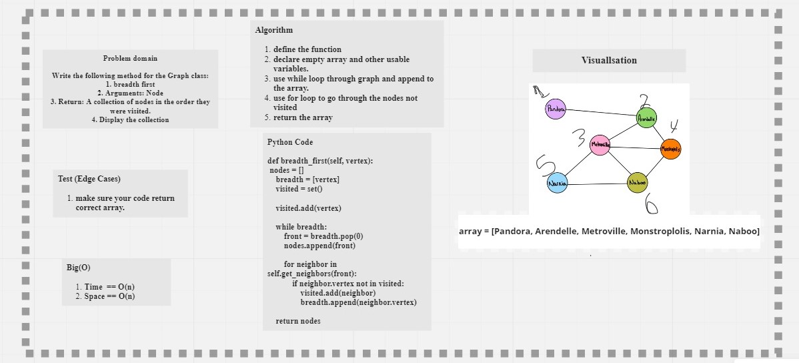

# Graphs
## Language: `Python`
## Challenge Type: ` Code Challenge / Extending an Implementation`

### [Code](https://github.com/mohammad-alshish/data-structures-and-algorithms/blob/main/graphs_breadth_first/graphs_breadth_first.py)
### [tests](https://github.com/mohammad-alshish/data-structures-and-algorithms/blob/main/tests/test_graphs_breadth_first.py)

## Challenge

Implement a breadth-first traversal on a graph.
Write the following method for the Graph class:
1. breadth first
2. Arguments: Node
3. Return: A collection of nodes in the order they were visited.
4. Display the collection

## Whiteboard Process
 

## Approach & Efficiency
We tried to keep our code as simple as possible to the best performance by reducing space/Time complexity
so we end with the following

Big O:
1. Time complexity => O(N) 
2. Space complexity => O(N) 

## API 
1. define the function
2. declare empty array and other usable variables.
3. use while loop through graph and append to the array.
4. use for loop to go through the nodes not visited
5. return the array

> The code have test folder, so you can run **`>>pytest .\tests\test_graphs_breadth_first.py`** and there is an example in the code file you can run it and check the output.