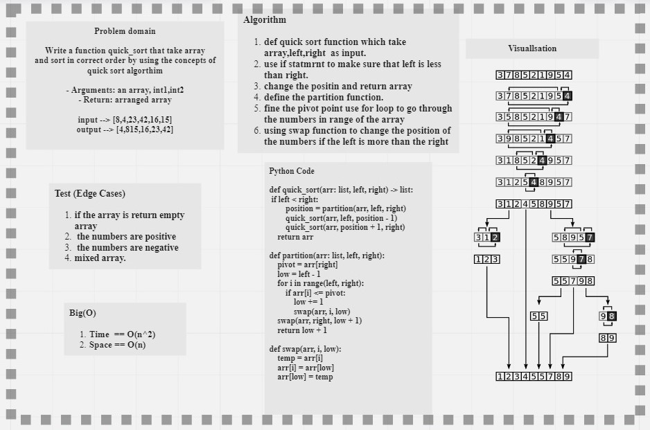

# Quick Sort

## -Language: `Python`
## -Challenge Type:  Code Challenge / Tracing a Pseudocode 

## [Code in Python](https://github.com/mohammad-alshish/data-structures-and-algorithms/blob/main/quick_sort/quick_sort.py)
## [tests](https://github.com/mohammad-alshish/data-structures-and-algorithms/blob/main/tests/test_quick_sort.py)
## [Code Tracing](https://mohammad-alshish.github.io/data-structures-and-algorithms/quick_sort/quick_sort_trace)

## -Assignment
Quick Sort

Review the pseudocode below, then trace the algorithm by stepping through the process with the provided sample array. 
Document your explanation by creating a blog article that shows the step-by-step output after each iteration through some sort of visual.
Once you are done with your article, code a working, tested implementation of Quick Sort based on the pseudocode provided.

### --> Pseudocode

    ALGORITHM QuickSort(arr, left, right)
      if left < right
        // Partition the array by setting the position of the pivot value
        DEFINE position <-- Partition(arr, left, right)
        // Sort the left
        QuickSort(arr, left, position - 1)
        // Sort the right
        QuickSort(arr, position + 1, right)

    ALGORITHM Partition(arr, left, right)
     // set a pivot value as a point of reference
      DEFINE pivot <-- arr[right]
     // create a variable to track the largest index of numbers lower than the defined pivot
      DEFINE low <-- left - 1
        for i <- left to right do
          if arr[i] <= pivot
             low++
            Swap(arr, i, low)

      // place the value of the pivot location in the middle.
       // all numbers smaller than the pivot are on the left, larger on the right.
         Swap(arr, right, low + 1)
       // return the pivot index point
     return low + 1

    ALGORITHM Swap(arr, i, low)
        DEFINE temp;
        temp <-- arr[i]
        arr[i] <-- arr[low]
        arr[low] <-- temp
## -Whiteboard Process

 

## -Approach & Efficiency

>Big(O)
>>- Time  == O(n^2)
>>- Space == O(n)
>>- **Note: you will find the description in the Trace**

## -Solution
- Algorithm

1. def quick sort function which take  array,left,right  as input.
2. use if statment to make sure that left is less than right.
3. change the position and return array
4. define the partition function.
5. fine the pivot point use for loop to go through the numbers in range of the array
6. using swap function to change the position of the numbers if the left is more than the right

The code have test folder so you can run **`pytest .\tests\test_quick_sort.py`** and there is an example in the code file you can run it and check the output.