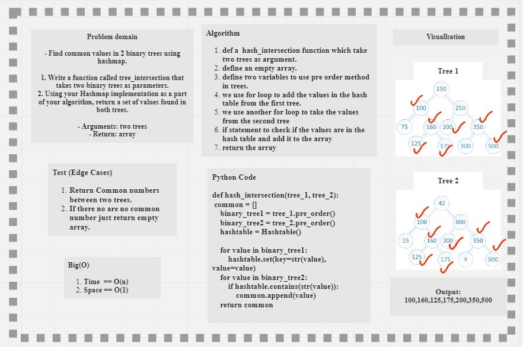

# HashMap

## Language: `Python`
## Challenge Type: ` Code Challenge / Algorithm`

## [Code](https://github.com/mohammad-alshish/data-structures-and-algorithms/blob/main/tree_intersection/tree_intersection.py)
## [tests](https://github.com/mohammad-alshish/data-structures-and-algorithms/blob/main/tests/test_tree_intersection.py)

## Challenge

- Find common values in 2 binary trees using hashmap.

1. Write a function called tree_intersection that takes two binary trees as parameters.
2. Using your Hashmap implementation as a part of your algorithm, return a set of values found in both trees.

## Whiteboard Process

## Approach & Efficiency
We tried to keep our code as simple as possible to the best performance by reducing space/Time complexity
so we end with the following:

### Big(O):
- Space: O(1)--> The function return one array.
- Time: O(n)--> the worst case in for loops

## Solution

1. def a  hash_intersection function which take two trees as argument.
2. define an empty array.
3. define two variables to use pre order method in trees.
4. we use for loop to add the values in the hash table from the first tree.
5. we use another for loop to take the values from the second tree 
6. if statement to check if the values are in the hash table and add it to the array
7. return the array

>The code have test folder so you can run 
> >**`pytest .\tests\test_tree_intersection.py`** 